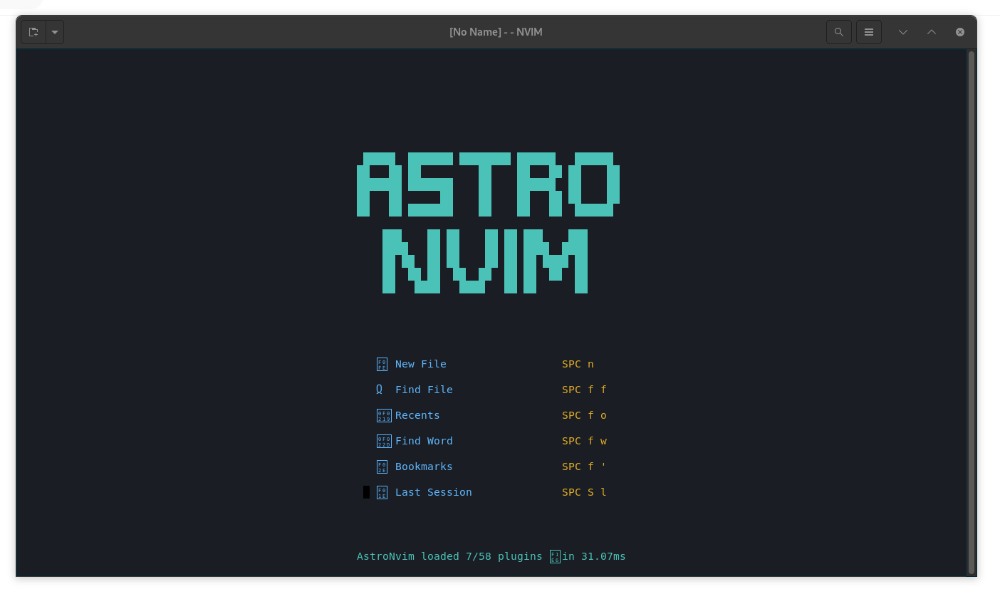
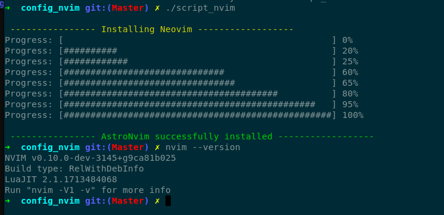

<h3 align="center">
  <h2 align="center" >Hi Every_1 </h2>

            .___      __    ________                      
            \_   ___ \  ____   __| _/_____/  |_  \_____  \___  __ ___________ 
             /    \  \/ /  _ \ / __ |\__  \   __\  /   |   \  \/ // __ \_  __ \
            \     \___(  <_> ) /_/ | / __ \_  |   /    |    \   /\  ___/|  | \/
             \______  /\____/\____ |(____  /__|   \_______  /\_/  \___  >__|   
                    \/            \/     \/               \/          \/      

</h3>

<h3 style="color: blue; font-size: 2em;text-align: center; "> Installing and configuring Nvim on Ubuntu without Sudo Premission is possible with this repository.</h3>
  

 
 

- [ ] clone repo in local Machine  
**git clone https://github.com/ahmedez-zouine/Nvim_42_Nosudo.git ~/config_nvim && cd ~/config_nvim**
- [ ] Run Script  
**Before running it, you must add permission to the file.**
> chmod +x script_nvim

 

 
<h4 style="text-align: center, color: blue, font-size : bold">AstroNvim successfully installed <h4>
